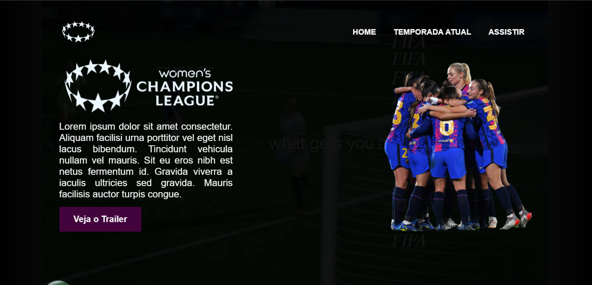

# Champions League Feminina

Projeto desenvolvido durante a Semana do Programador do Zero ao Contratado do <a href="https://github.com/devemdobro">Dev em Dobro</a>, onde fomos desafiados também a criar a nossa página personalizada. Esse projeto é a minha própria estilização baseada no projeto disposto. Minha versão idêntica ao gêmeos pode ser conferida <a href="https://github.com/ssschneider/projeto-mario">aqui</a>

## 🔧 Tecnologias
- Typescript
- TSX
- React
- Styled-Components
- ViteJS

## 🔗 Acesso

Para acessar o projeto, basta <a href="!">clicar aqui </a>!

## 💻 Demo

| Versão Desktop  | Versão Mobile |
| -------------- |-------------- |
|  |  |